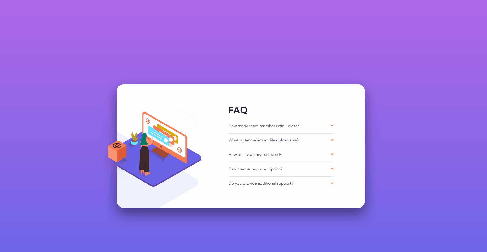
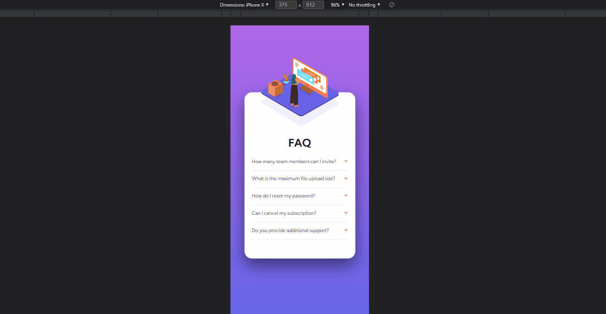

# Frontend Mentor - FAQ accordion card solution

This is a solution to the [FAQ accordion card challenge on Frontend Mentor](https://www.frontendmentor.io/challenges/faq-accordion-card-XlyjD0Oam). Frontend Mentor challenges help you improve your coding skills by building realistic projects. 

## Table of contents

- [Overview](#overview)
  - [The challenge](#the-challenge)
  - [Screenshot](#screenshot)
  - [Links](#links)
- [My process](#my-process)
  - [Built with](#built-with)
  - [What I learned](#what-i-learned)
  - [Continued development](#continued-development)
  - [Useful resources](#useful-resources)
- [Author](#author)
- [Acknowledgments](#acknowledgments)

**Note: Delete this note and update the table of contents based on what sections you keep.**

## Overview

### The challenge

Users should be able to:

- View the optimal layout for the component depending on their device's screen size
- See hover states for all interactive elements on the page
- Hide/Show the answer to a question when the question is clicked

### Screenshot

#### Desktop


#### Mobile


#### Extreme


### Links

- Solution URL: [https://github.com/obasekiosa/faq-accordion-card](https://github.com/obasekiosa/faq-accordion-card)
- Live Site URL: [https://obasekiosa.github.io/faq-accordion-card/](https://obasekiosa.github.io/faq-accordion-card/)

## My process

### Built with

- Semantic HTML5 markup
- CSS custom properties
- Flexbox
- CSS Grid
- Mobile-first workflow
- Javascript


### What I learned

- I learned about event listeners,
- CSS selector precedence.
- `!important`

```js
window.onload= e => {
    console.log("Win loaded");
    setOnClickEvents();
};

let previous = null;


function setOnClickEvents() {
    let questions = document.querySelectorAll(".question__wrapper");
    if (questions && questions.length > 0) {
        questions.forEach((e) => {
            let question = e.querySelector(".heading");
            question.addEventListener("click", () => makeActive(e));
        })
    }
}

function makeActive(element) {
    if (previous && previous != element) {
        previous.classList.remove("selected");
    }
    element.classList.toggle("selected");

    if (previous !== element) {
        previous = element;
    }
    
}
```

### Continued development

Javascript and event listeners

### Useful resources

- [Example resource 1](https://www.example.com) - This helped me for XYZ reason. I really liked this pattern and will use it going forward.
- [Example resource 2](https://www.example.com) - This is an amazing article which helped me finally understand XYZ. I'd recommend it to anyone still learning this concept.

## Author

- Website - [Osakpolor Obaseki](https://obasekiosa.github.io/me)
- Frontend Mentor - [@obasekiosa](https://www.frontendmentor.io/profile/obasekiosa)
- Twitter - [@obasekiosa](https://www.twitter.com/obasekiosa)


## Acknowledgments

This is where you can give a hat tip to anyone who helped you out on this project. Perhaps you worked in a team or got some inspiration from someone else's solution. This is the perfect place to give them some credit.
